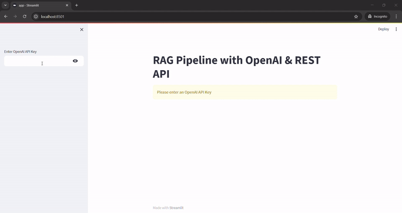

# Retrieval-Augmented Generation (RAG) System

## Overview

This project implements a Retrieval-Augmented Generation (RAG) system that processes, indexes, and retrieves knowledge from documents using Sentence Transformers for embeddings and FAISS for efficient vector search. An LLM (OpenAI GPT) can generate answers based on retrieved content.



## Features

- Support for multiple document formats (PDF, DOCX, TXT)
- Semantic search using sentence transformers
- GPT-powered answer generation
- Dual interface: Web UI (Streamlit) and REST API
- Docker support for easy deployment

## Project Structure
```
rag-pipeline/
├── app/
│   ├── __init__.py
│   ├── api.py
│   ├── config.py
│   ├── models.py
│   └── streamlit_app.py
├── app.py
├── docker-compose.yml
├── Dockerfile
└── requirements.txt
```

## System Architecture

### 1. Document Processing
- Extracts text from PDF, DOCX, TXT files.
- Splits text into chunks.
- Encodes chunks into vector embeddings using Sentence Transformers.
- Stores embeddings in a FAISS (Facebook AI Similarity Search) vector database.

### 2. Semantic Search
- Queries are encoded as vector embeddings.
- FAISS retrieves the most relevant document chunks.

### 3. LLM Answer Generation
- If an OpenAI API key is provided, it generates answers based on retrieved document content.
- Uses OpenAI GPT to generate answers from retrieved context.

### 4. API Interface
- Built with FastAPI, exposing REST endpoints.

### 5. User Interface
- Streamlit-based UI for user interaction.
- Allows document upload, search queries, and LLM-generated answers.

### 6. Containerization
- Dockerized for easy deployment with Docker & Docker Compose.

## API Documentation

### Health Check
```http
GET /health
