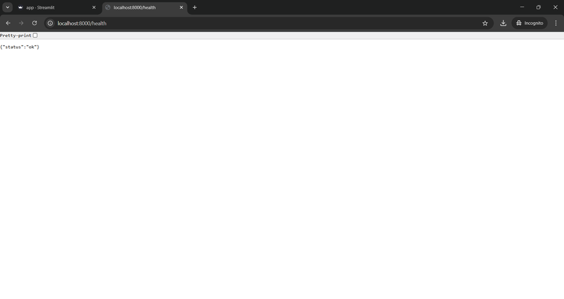
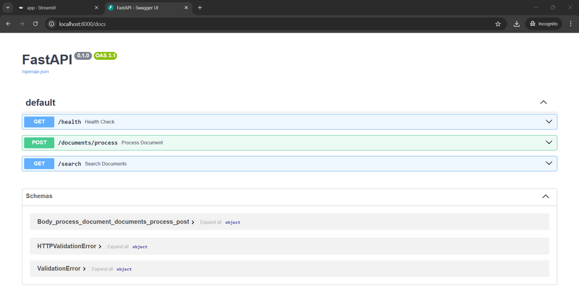

# Retrieval-Augmented Generation (RAG) System

## Overview

This project implements a Retrieval-Augmented Generation (RAG) system that processes, indexes, and retrieves knowledge from documents using Sentence Transformers for embeddings and FAISS for efficient vector search. An LLM (OpenAI GPT) can generate answers based on retrieved content.


## Features

- Support for multiple document formats (PDF, DOCX, TXT)
- Semantic search using sentence transformers
- GPT-powered answer generation
- Dual interface: Web UI (Streamlit) and REST API
- Docker support for easy deployment

## Project Structure
```
Retrieval_Augmented_Generation_RAG/
├── app/
│   ├── __init__.py
│   ├── api.py
│   ├── config.py
│   ├── models.py
│   └── streamlit_app.py
├── app.py
├── docker-compose.yml
├── Dockerfile
└── requirements.txt
```

## System Architecture

### 1. Document Processing
- Extracts text from PDF, DOCX, TXT files.
- Splits text into chunks.
- Encodes chunks into vector embeddings using Sentence Transformers.
- Stores embeddings in a FAISS (Facebook AI Similarity Search) vector database.

### 2. Semantic Search
- Queries are encoded as vector embeddings.
- FAISS retrieves the most relevant document chunks.

### 3. LLM Answer Generation
- If an OpenAI API key is provided, it generates answers based on retrieved document content.
- Uses OpenAI GPT to generate answers from retrieved context.

### 4. API Interface
- Built with FastAPI, exposing REST endpoints.

### 5. User Interface
- Streamlit-based UI for user interaction.
- Allows document upload, search queries, and LLM-generated answers.

### 6. Containerization
- Dockerized for easy deployment with Docker & Docker Compose.

## API Documentation

### Health Check
```
GET /health
```


### Process Document
```
POST /docs
```



## Quick Start

### Prerequisites

- Docker and Docker Compose installed
- OpenAI API key

### Running with Docker

1. Build and run the Docker container:
```bash
docker-compose up --build
```

2. Access the applications:
   - Streamlit UI: [http://localhost:8501](http://localhost:8501)
   - FastAPI: [http://localhost:8000](http://localhost:8000)
   - API Documentation: [http://localhost:8000/docs](http://localhost:8000/docs)

### Manual Setup (Dont needed, Docker runs properly)

1. Create a virtual environment:
```bash
python -m venv venv
source venv/bin/activate  # On Windows: venv\Scripts\activate
```

2. Install dependencies:
```bash
pip install -r requirements.txt
```

3. Run the application:
```bash
python app.py
```

## Usage Guide

### Streamlit Interface

1. Open [http://localhost:8501](http://localhost:8501)
2. Enter your OpenAI API key in the sidebar
3. Upload documents using the file uploader
4. Enter your search query
5. View retrieved passages and generated answers

### REST API

#### Process a Document
```bash
curl -X POST "http://localhost:8000/documents/process" \
     -H "accept: application/json" \
     -H "Content-Type: multipart/form-data" \
     -F "file=@your_document.pdf"
```

#### Search Documents
```bash
curl -X GET "http://localhost:8000/search?query=your%20search%20query&top_k=5" \
     -H "accept: application/json"
```

## Configuration

Key settings can be modified in `config.py`:

- `EMBEDDING_MODEL`: The sentence transformer model to use
- `CHUNK_SIZE`: Size of document chunks
- `CHUNK_OVERLAP`: Overlap between chunks
- `MAX_TOKENS`: Maximum tokens for GPT response
- `OPENAI_MODEL`: OpenAI model to use

## Notes

- The application runs both Streamlit and FastAPI servers simultaneously
- Docker configuration exposes ports 8501 (Streamlit) and 8000 (FastAPI)
- Remember to properly handle the OpenAI API key in production environments

## Author

Cansu Beyaz
